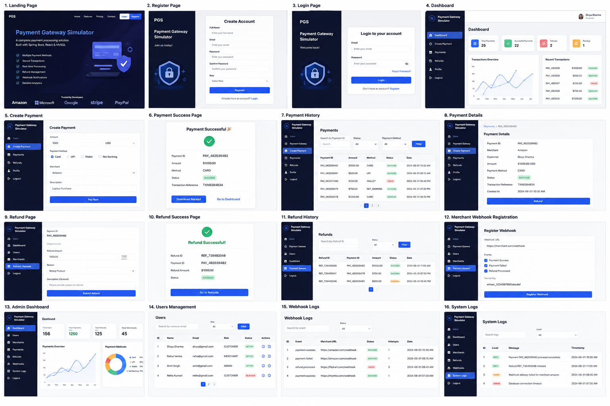

# 💳 Payment Gateway Simulator

A secure backend application built using **Spring Boot** that simulates the lifecycle of an online payment gateway. The project demonstrates payment processing, JWT authentication, validation, exception handling, and RESTful API development without integrating a real payment provider.

---

## 📸 Project Preview



---
## Features

- User Authentication using Spring Security & JWT
- Create a Payment
- Fetch Payment by ID
- Fetch All Payments
- Update Payment Status
- Delete Payment
- DTO Validation
- Global Exception Handling
- Transaction ID Generation
- RESTful APIs
- MySQL Database Integration
- Docker Compose for MySQL

---

## 🛠️ Tech Stack

### Backend
- Java 17
- Spring Boot
- Spring Security
- Spring Data JPA (Hibernate)
- Maven

### Database
- MySQL

### Security
- JWT Authentication
- BCrypt Password Encoder

### Tools
- IntelliJ IDEA
- Postman
- Docker
- Git
- GitHub

---

## 📂 Project Structure

```
src
 ├── controller
 ├── service
 ├── repository
 ├── entity
 ├── dto
 ├── mapper
 ├── exception
 ├── config
 ├── util
 └── enums
```

---

## 📌 API Endpoints

| Method | Endpoint | Description |
|---------|----------|-------------|
| POST | /payments | Create Payment |
| GET | /payments | Get All Payments |
| GET | /payments/{id} | Get Payment by ID |
| PUT | /payments/{id} | Update Payment |
| DELETE | /payments/{id} | Delete Payment |

---

## 🔒 Security

- JWT Authentication
- Password Encryption using BCrypt
- Protected REST APIs
- Stateless Authentication

---

## 🗄️ Database

- MySQL
- Spring Data JPA
- Hibernate ORM

---

## 💡 Why This Project?

Modern payment systems demand security, scalability, and reliability.

This project demonstrates how those concepts can be implemented using Spring Boot while following clean architecture and RESTful design principles.

It serves as a foundation for building enterprise-grade payment solutions and will continue evolving with additional production-ready features.

---

Happy Coding! 🚀